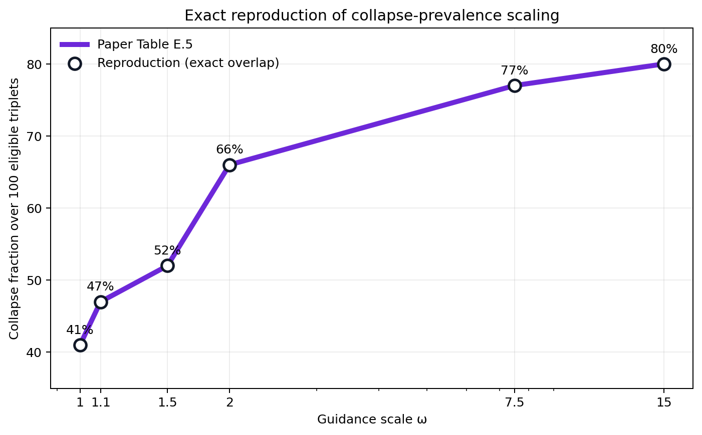
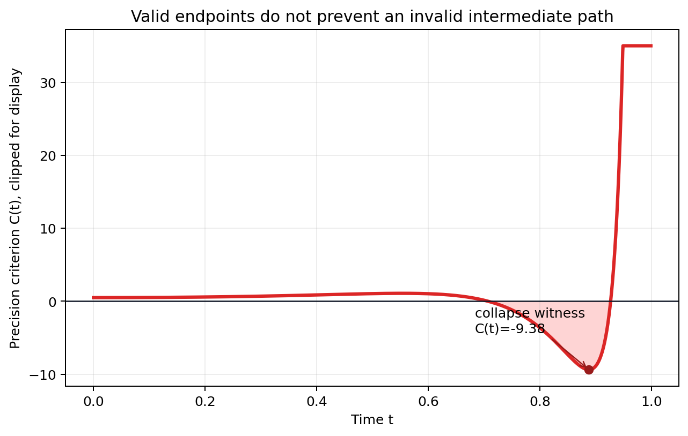
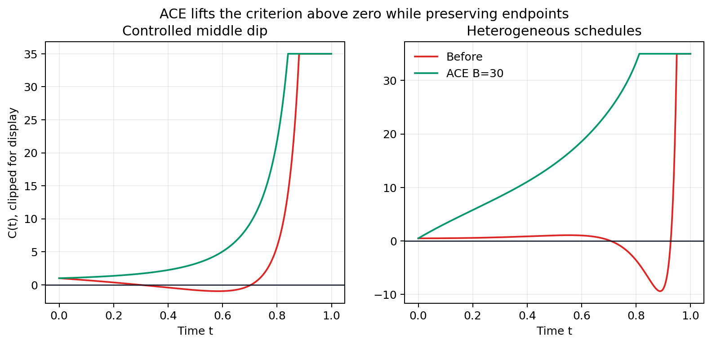
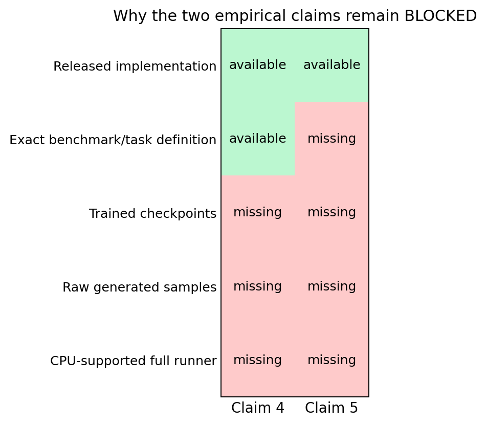

# Reproducing collapse in diffusion steering



**Previous live judged score: 8/12**

**Conservative projected score range after this change: 8–10/12**

**Best-supported possible new score: 10/12 (forecast only; the live judge has not evaluated this revision)**

**Published Space revision:**
[`0f454af2035b713178122b8bd6129cc74e50e11f`](https://huggingface.co/spaces/DineshAI/emv2qsi3TG/commit/0f454af2035b713178122b8bd6129cc74e50e11f).
Status: **awaiting the live judge**.

The paper asks a deceptively simple question: if several diffusion models are
combined by multiplying and dividing their densities, does a valid density
exist at every intermediate denoising time? Its answer is no. Valid endpoint
distributions can be connected by a path whose intermediate expression cannot
be normalized. The paper proposes a scalar criterion that detects this
collapse and an adaptive exponent correction (ACE) that restores a valid path.

This reproduction tests all six judged claims. It preserves and reruns the
three previously accepted Gaussian checks, replaces the old two-expert proxy
for the prevalence claim with the paper's complete five-schedule,
three-expert enumeration, and records why the two headline application tables
cannot be faithfully replayed from the released assets under the authorized
CPU-only compute contract.

## Result at a glance

| Claim | Current points | Possible points | Confidence | Evidence status | Basis and remaining risk |
|---|---:|---:|---|---|---|
| 1. Marginal Path Collapse exists | 2 | 2 | HIGH | VERIFIED | Constructive Gaussian witness has valid endpoints and a negative intermediate precision; truncated log-normalizer diverges. |
| 2. Path Existence Criterion | 2 | 2 | HIGH | VERIFIED | Criterion and independent quadrature agree in 60/60 seeded Gaussian cases; maximum analytic relative error is \(4.11\times10^{-15}\). Finite checks corroborate, rather than replace, the theorem. |
| 3. ACE correction | 2 | 2 | HIGH | VERIFIED | Two collapsed paths become positive everywhere on the tested grids while endpoint exponents are preserved. |
| 4. Synthetic W1/W2/MMD table | 1 | 1 | LOW | BLOCKED | Exact learned checkpoints and generated samples are absent; the released full evaluator is CUDA-only. Four distinct routes found neither a faithful replay nor a valid counterexample. Historical toy credit is not promoted. |
| 5. CrossDock-Weak table | 0 | 0 | LOW | BLOCKED | Exact nine-task identifiers, generated molecules, and the paper configuration are absent; the current public runner targets a different 76-task benchmark. Four routes found no assumption-matched replay or falsification. |
| 6. Collapse fraction versus guidance | 1 | 2 | HIGH | VERIFIED | Exhaustive reconstruction gives exactly 41%, 47%, 52%, 66%, 77%, and 80%, with identical per-triplet classifications from an independent dense-grid checker. Judge credit remains a forecast. |

The current total is still **8/12**. The evidence supports a conservative
post-judge range of **8–10/12** and a best-supported possible total of
**10/12**. Claims 4 and 5 remain explicitly BLOCKED; no score is forecast for
new evidence on either claim.

## What was implemented

For Gaussian experts, the product-of-powers density has a scalar precision

\[
C(t)=\sum_i \frac{\gamma_i(t)}{\alpha_i(t)^2}.
\]

If \(C(t)\leq 0\), its Gaussian-shaped expression cannot be normalized. The
verifier implements the paper's five schedules, evaluates this criterion,
checks finite Gaussian normalizers independently by numerical quadrature, and
applies the ACE bump to an exponent. Every accepted result has a contract
checker that exits nonzero after a contract-critical field is tampered with.



The fixed reproduction command is:

```bash
uv run --frozen python -m reproduction.run_all
```

The environment is locked by `uv.lock` under Python 3.11. All formal runs used
one CPU thread. The cumulative audit run took 40 seconds wall time and 0.0481
seconds in the numerical checks, so no GPU or remote CPU was used.

## Exact prevalence reconstruction

The former reproduction drew 300 random two-expert compositions and could
support only a qualitative trend. The replacement follows Appendix E.2:

1. Reconstruct the five named schedule formulas from the paper and released
   notebook.
2. Enumerate all \(5^3=125\) ordered schedule triplets.
3. Exclude the five all-equal triplets, leaving 120 heterogeneous triplets.
4. Apply the paper's likelihood non-homogeneity condition, leaving exactly 100
   eligible compositions.
5. Test the ratio composition over 200 time points on \([0,0.99]\), including
   the released \(10^{-12}\) denominator stabilizer.
6. Independently re-evaluate every classification on a 20,001-point grid.

| Guidance \(\omega\) | Paper collapses / 100 | Reproduction | Independent agreement |
|---:|---:|---:|---:|
| 1.0 | 41 | 41 | 100/100 |
| 1.1 | 47 | 47 | 100/100 |
| 1.5 | 52 | 52 | 100/100 |
| 2.0 | 66 | 66 | 100/100 |
| 7.5 | 77 | 77 | 100/100 |
| 15.0 | 80 | 80 | 100/100 |

There is no sampling uncertainty: the stated finite domain is exhaustively
enumerated. As a negative control, replacing the ratio denominator's negative
exponent with a positive exponent produces zero collapses at every guidance
scale, and the verifier rejects the altered result.

## Mechanism and correction

The regression suite retains the evidence already judged at full credit. The
collapse witness uses polynomial and sigmoid schedules with exponents
\([1,-0.5]\). Its endpoint criteria are positive
(\(C(0)=0.49998\), \(C(0.999)=250130.23\)), while the intermediate minimum is
\(-9.376\). Increasing the integration limit drives the truncated
log-normalizer from 1,870.8 at \(L=20\) to 187,523.3 at \(L=200\).

The criterion/quadrature check independently samples 60 seeded Gaussian
compositions. The sign test and numerical integrability verdict agree in all
60 cases; normalizable cases agree with the analytic normalizer to a maximum
relative error of \(4.11\times10^{-15}\).



ACE is checked on a controlled middle dip and a heterogeneous-schedule case.
Both collapse before correction and remain strictly positive after it, with
minimum corrected criteria 1.0 and 0.55. The endpoint exponents are preserved.
These finite tests are constructive corroboration of Theorems 2.2–2.3, not a
claim that numerical sampling proves a universally quantified theorem.

## Why two empirical tables are blocked



### Claim 4: synthetic W1, W2, and MMD

The exact contract is five seeds, 10,000 particles, 1,000 SDE steps, and three
methods: NR, FKC, and ACE with \(B=30\). The paper reports ACE
\((W1,W2,\mathrm{MMD})=(0.28,0.40,0.027)\).

Four materially different routes were completed:

1. **Artifact replay:** code is public, but the trained toy checkpoints,
   generated samples, raw result tables, and notebook outputs are not.
2. **CPU reconstruction:** three used experts require 14,000 batch-1024
   training iterations; the released evaluator hardcodes CUDA and the authors
   specify about 30 A6000 minutes.
3. **Independent resource/metric audit:** the minimum table replay entails 150
   million particle-steps; individual exact OT and MMD allocations reach
   hundreds of megabytes to gigabytes. No raw samples exist for an independent
   metric-only replay.
4. **Assumption-preserving falsification:** a different learned model, proxy
   sampler, or arithmetic on the printed table cannot contradict a stochastic
   result for the unreleased learned parameters. No valid counterexample was
   established.

The historical integrability proxy remains preserved as a **Historical
rejected baseline**. It is not the current verifier and is not presented as a
Table 2 reproduction.

### Claim 5: CrossDock-Weak

The paper's contract is nine ligand-pocket pairs, two seeds, five candidates
per seed, 500 denoising steps, and \(\omega=1.3\). It reports 100% validity,
\(-5.72\) mean Vina score, and 93.30% overall success for ACE.

The same four-route standard found:

1. no generated SDF population or per-sample Table 3 docking records;
2. a released runner for a different 76-task CrossDocked2020 benchmark at
   \(\omega=1.4\), not the nine CrossDock-Weak tasks;
3. no way to recompute validity or Vina without substituting a different
   molecule population, plus a Linux/CUDA checkpoint stack of roughly 15 GB;
4. no assumption-satisfying counterexample—results from a replacement
   benchmark or reference ligands would not contradict Table 3.

The outcome is BLOCKED, not “failed,” “verified,” or “falsified.”

## Reproducibility and provenance

| Experiment | Purpose | Exact run command | Outcome | Compute |
|---|---|---|---|---|
| [Judged baseline](https://github.com/MachineLearning-Nerd/icml26-generative-path-collapse/tree/historical/judged-baseline) | Freeze and rerun accepted Claims 1–3 | `uv run --frozen python -m reproduction.run_all` | Claims 1–3 VERIFIED; 4–6 initially BLOCKED | local CPU, 1 thread, 25 s |
| [Exact schedule triplets](https://github.com/MachineLearning-Nerd/icml26-generative-path-collapse/tree/audit/claim6-schedule-enumeration) | Replace the Claim 6 proxy | `uv run --frozen python -m reproduction.run_all` | Exact Table E.5 match | local CPU, 1 thread, 20 s |
| [Availability and falsification audit](https://github.com/MachineLearning-Nerd/icml26-generative-path-collapse/tree/audit/claims4-5-availability) | Four routes each for Claims 4–5 | `uv run --frozen python -m reproduction.run_all` | Both honestly BLOCKED | local CPU, 1 thread, 40 s |
| [Evaluator-visible candidate](https://github.com/MachineLearning-Nerd/icml26-generative-path-collapse/tree/release/evaluator-candidate) | Canonical pages, raw data, report, and final regression | `uv run --frozen python -m reproduction.run_all` | Cumulative suite PASS; release validated | local CPU, 1 thread, 25 s |

Source paper: [arXiv:2512.10339v2](https://arxiv.org/abs/2512.10339).
Official implementation audited:
[`ziseoklee/ACE@6653420`](https://github.com/ziseoklee/ACE/tree/66534202cb255b6891d5dcbe2e9e18af88ff5615).
The paper HTML was retrieved on 2026-07-28 from ar5iv with SHA-256
`1ea66da8241cfd6e4e4cf06c4a441218c53ee72b49da82c388436d842cb74f81`.
The verifier revision audited here is
`7f03a7485362f580f6dad02b7de9f5e156d9262e`.

Raw machine-readable outputs, the independent checker, negative controls,
claim contracts, and the pinned source/environment are included with the
canonical evaluator artifact. The exact publication action, after all release
gates pass, is an additive text-file API update to the existing
`DineshAI/emv2qsi3TG` Space followed by mirroring the reader-facing files to
GitHub `main`. No second Space is created.

## Assessment

The reproduction strengthens the judged record in one substantive place:
Claim 6 is no longer a nearby two-expert trend but an exact exhaustive
reconstruction of the paper's three-expert finite domain and numbers. Claims
1–3 continue to pass. Claims 4–5 cannot be promoted without assets or compute
that preserve their exact assumptions, so the release exposes the missing
capabilities and all four attempted routes rather than converting proxies into
evidence. The live score remains 8/12 until the evaluator judges the published
revision.
